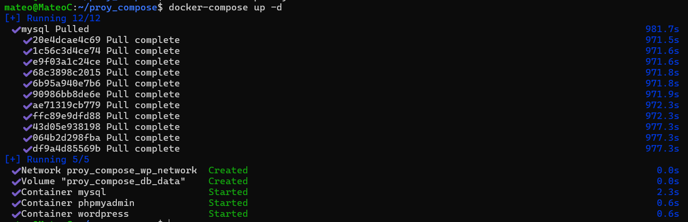
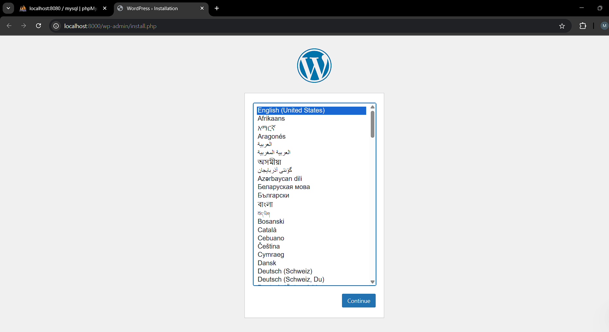
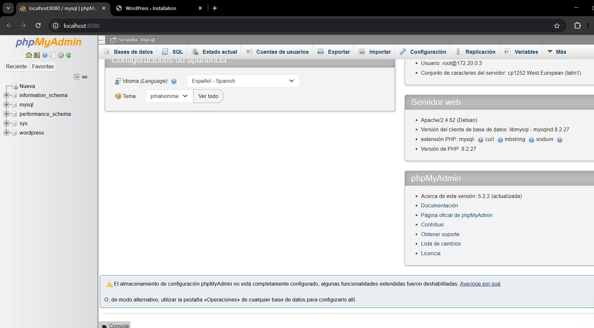

# Informe de la Práctica: Configuración de un Entorno con Docker Compose para WordPress y MySQL

## 1. Título
**Configuración de un Entorno con Docker Compose para WordPress, MySQL y PhpMyAdmin**

## 2. Tiempo de duración
**15 minutos**

## 3. Fundamentos

En esta práctica, se utilizó **Docker Compose** para crear un entorno de desarrollo con tres servicios: **WordPress**, **MySQL** y **PhpMyAdmin**. **Docker Compose** permite definir y ejecutar aplicaciones multi-contenedor de manera sencilla mediante un archivo `docker-compose.yml`. En este caso, se busca demostrar cómo integrar WordPress con MySQL como base de datos y gestionar la base de datos mediante PhpMyAdmin, todo dentro de contenedores Docker.

### Comandos Utilizados

- `docker-compose up`: Para crear y ejecutar los servicios definidos en el archivo `docker-compose.yml`.
- `docker-compose down`: Para detener y eliminar los contenedores y redes asociados.
- `docker-compose logs`: Para visualizar los logs de los servicios.
  
## 4. Conocimientos previos

- Conocimientos básicos de Docker y Docker Compose.
- Familiaridad con la creación y administración de contenedores Docker.
- Conocimientos sobre WordPress y bases de datos PostgreSQL/MySQL.

## 5. Objetivos a alcanzar

- Entender cómo configurar un entorno de desarrollo con Docker Compose.
- Integrar WordPress con MySQL.
- Utilizar PhpMyAdmin para gestionar la base de datos MySQL desde un entorno gráfico.
- Familiarizarse con la estructura de un archivo `docker-compose.yml`.

## 6. Equipo necesario

- **Computadora con Docker y Docker Compose instalados**: Se utilizó una máquina con Docker configurado.
- **Editor de texto**: Para modificar el archivo `docker-compose.yml`.
- **Terminal**: Para ejecutar los comandos de Docker Compose.
- **Navegador**: Para acceder a la interfaz de WordPress y PhpMyAdmin.

## 7. Material de apoyo

- Documentación oficial de Docker Compose: [https://docs.docker.com/compose/](https://docs.docker.com/compose/)
- Documentación de WordPress: [https://wordpress.org/support/](https://wordpress.org/support/)
- Documentación de PostgreSQL: [https://www.postgresql.org/docs/](https://www.postgresql.org/docs/)
  
---

## 8. Procedimiento

### Parte 1: Creación del archivo `docker-compose.yml`

#### 1. Crear un directorio para el proyecto

```bash
mkdir proy_compose
cd proy_compose
```

#### 2. Crear el archivo `docker-compose.yml`

El archivo `docker-compose.yml` tiene la siguiente estructura, donde se definen los tres servicios:

```yaml

services:
  mysql:
    image: mysql:5.7
    container_name: mysql
    restart: always
    environment:
      MYSQL_ROOT_PASSWORD: rootpass
      MYSQL_DATABASE: wordpress
      MYSQL_USER: wpuser
      MYSQL_PASSWORD: wppass
    volumes:
      - db_data:/var/lib/mysql
    networks:
      - wp_network

  wordpress:
    image: wordpress:latest
    container_name: wordpress
    restart: always
    ports:
      - "8000:80"
    environment:
      WORDPRESS_DB_HOST: mysql:3306
      WORDPRESS_DB_NAME: wordpress
      WORDPRESS_DB_USER: wpuser
      WORDPRESS_DB_PASSWORD: wppass
    depends_on:
      - mysql
    networks:
      - wp_network

  phpmyadmin:
    image: phpmyadmin/phpmyadmin
    container_name: phpmyadmin
    restart: always
    ports:
      - "8080:80"
    environment:
      PMA_HOST: mysql
      PMA_USER: root
      PMA_PASSWORD: rootpass
    depends_on:
      - mysql
    networks:
      - wp_network

volumes:
  db_data:

networks:
  wp_network:

```

### Parte 2: Levantar los servicios

Una vez creado el archivo `docker-compose.yml`, se ejecutan los servicios con el siguiente comando:

```bash
docker-compose up -d
```
<p align="center">
  
</p>

Este comando descarga las imágenes necesarias y crea los contenedores para los tres servicios: WordPress, MySQl y PhpMyAdmin.

#### 1. Verificación de la ejecución

- **WordPress**: Accede a [http://localhost:8000](http://localhost:8000) en tu navegador y realiza la configuración inicial de WordPress.

<p align="center">
  
</p>

- **PhpMyAdmin**: Accede a [http://localhost:8081](http://localhost:8080) para gestionar la base de datos PostgreSQL.

<p align="center">
  
</p>
#### 2. Detener los servicios

Para detener los servicios y eliminar los contenedores asociados:

```bash
docker-compose down
```

---

## 9. Resultados

La configuración y ejecución de los contenedores fue exitosa. Los tres servicios (WordPress, MySQL y PhpMyAdmin) se integraron correctamente, permitiendo que WordPress utilizara PostgreSQL como base de datos. PhpMyAdmin permitió gestionar la base de datos sin problemas. Al utilizar Docker Compose, se logró simplificar la orquestación de contenedores y la administración de servicios, todo dentro de un único archivo de configuración.

---

## 10. Conclusiones

El uso de **Docker Compose** para configurar un entorno de desarrollo con múltiples servicios facilita significativamente la creación de aplicaciones complejas. En este caso, integrar WordPress con MySQL como base de datos, gestionado a través de PhpMyAdmin, demostró la flexibilidad y facilidad de uso de Docker para implementar entornos de desarrollo de forma eficiente y rápida. Además, el uso de volúmenes garantiza que los datos de la base de datos sean persistentes.

---

## 11. Bibliografía

1. Docker Documentation. (2024). *Docker Docs*. https://docs.docker.com/
2. PostgreSQL Documentation. (2024). *PostgreSQL Docs*. https://www.postgresql.org/docs/
3. WordPress Documentation. (2024). *WordPress Docs*. https://wordpress.org/support/